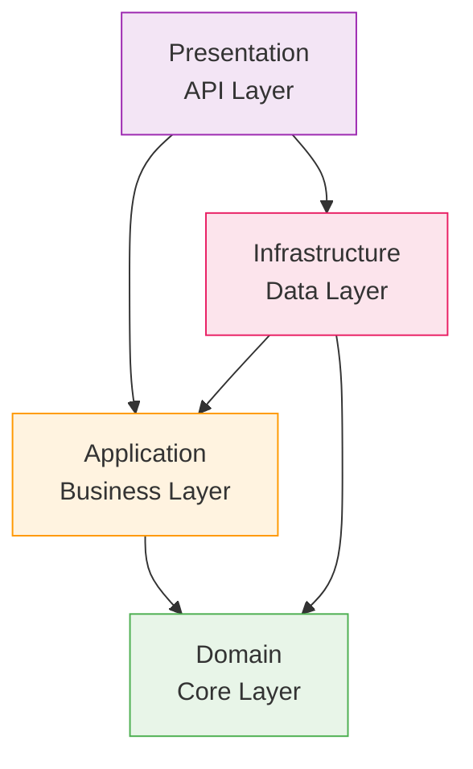

 [[🎮 방치형 RPG 서버 개발 완전 가이드 - Week 1]]# Clean Architecture 개념 정리

## 📖 정의
**Clean Architecture**는 소프트웨어 아키텍처 패턴으로, **비즈니스 로직을 외부 구현 세부사항으로부터 분리**하는 설계 원칙입니다.

## 🎯 핵심 원칙
1. **의존성 역전**: 내부 레이어는 외부 레이어에 의존하지 않음
2. **관심사 분리**: 각 레이어는 고유한 책임을 가짐  
3. **테스트 용이성**: 각 레이어를 독립적으로 테스트 가능
4. **유연성**: 외부 구현 변경시 내부 로직 영향 없음

## 🏗️ 레이어 구조

### 의존성 방향

## 🔍 각 레이어의 역할

### 1. Domain Layer (핵심)
- **역할**: 비즈니스 규칙, 엔티티, 도메인 로직
- **의존성**: 다른 레이어에 의존하지 않음
- **예시**: Player, Character, Item 클래스

### 2. Application Layer (조율)
- **역할**: 유스케이스, 비즈니스 서비스
- **의존성**: Domain에만 의존
- **예시**: PlayerService, RewardService

### 3. Infrastructure Layer (구현)  
- **역할**: 데이터베이스, 외부 API, 캐시
- **의존성**: Domain과 Application에 의존
- **예시**: Repository, DbContext, Cache

### 4. Presentation Layer (인터페이스)
- **역할**: API 엔드포인트, 사용자 인터페이스
- **의존성**: Application과 Infrastructure에 의존
- **예시**: Controllers, API 엔드포인트

## 💡 Unity 개발자를 위한 비유

| Clean Architecture | Unity 대응 | 설명 |
|-------------------|-----------|------|
| Domain | GameObject/Component | 게임의 핵심 객체와 로직 |
| Application | Manager 클래스 | GameManager, UIManager 등 |
| Infrastructure | Unity Services | Networking, Analytics 등 |
| Presentation | UI System | Canvas, UI 컴포넌트 |

## 🎮 방치형 RPG에서의 적용
- [[Clean Architecture - Domain Layer 상세]]
- [[Clean Architecture - Application Layer 상세]] 
- [[Clean Architecture - Infrastructure Layer 상세]]
- [[Unity vs Clean Architecture 비교분석]]

---

## 🔗 관련 문서
- [[Week 1 Day 0 - 환경구축 완료]]
- [[방치형 RPG 서버 설계 노트]]

*작성일: 2025년 9월 26일*