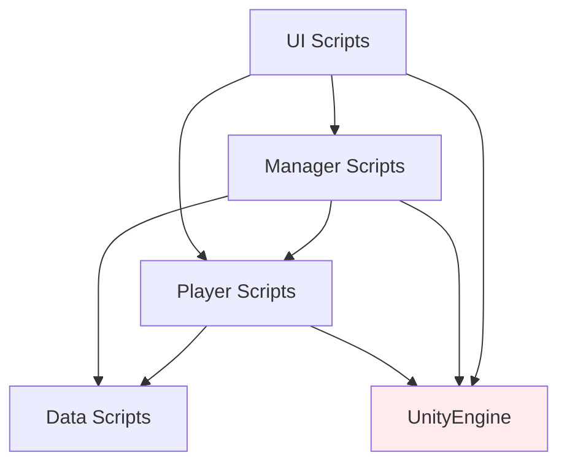
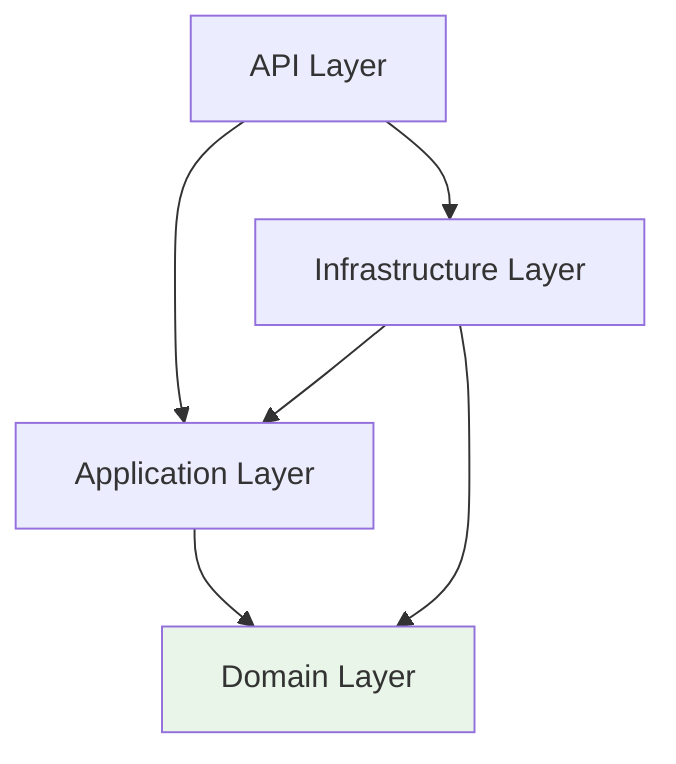

 [[🎮 방치형 RPG 서버 개발 완전 가이드 - Week 1]]# Unity vs Clean Architecture 비교분석

## 🎯 개요
3년차 Unity 개발자가 Clean Architecture를 쉽게 이해할 수 있도록 **Unity의 아키텍처 패턴과 Clean Architecture를 직접 비교**합니다.

## 🏗️ 아키텍처 구조 비교

### Unity 프로젝트 구조
```
Unity Project/
├── Scripts/
│   ├── Managers/         # 게임 시스템 관리
│   │   ├── GameManager.cs
│   │   ├── UIManager.cs
│   │   └── SaveManager.cs
│   ├── Player/           # 플레이어 관련
│   │   ├── PlayerController.cs
│   │   ├── PlayerStats.cs
│   │   └── PlayerInventory.cs
│   ├── UI/              # 사용자 인터페이스
│   │   ├── MainMenu.cs
│   │   └── GameHUD.cs
│   └── Data/            # 데이터 관리
│       ├── SaveData.cs
│       └── GameConfig.cs
├── Prefabs/
├── Scenes/
└── StreamingAssets/
```

### Clean Architecture 구조
```
Server Project/
├── Domain/              # 핵심 게임 로직
│   ├── Entities/
│   │   ├── Player.cs
│   │   ├── Character.cs
│   │   └── OfflineReward.cs
│   └── Interfaces/
├── Application/         # 비즈니스 서비스
│   ├── Services/
│   │   ├── PlayerService.cs
│   │   └── RewardService.cs
│   └── DTOs/
├── Infrastructure/      # 외부 시스템 연결
│   ├── Data/
│   ├── Cache/
│   └── External/
└── API/                # 클라이언트 인터페이스
    ├── Controllers/
    └── Middlewares/
```

## 📊 레이어별 상세 비교

### 1. 핵심 로직 레이어

| 특성 | Unity | Clean Architecture |
|------|-------|-------------------|
| **위치** | Scripts/Player/, Scripts/Game/ | Domain Layer |
| **역할** | GameObject 동작, 게임 규칙 | 비즈니스 엔티티, 도메인 로직 |
| **의존성** | UnityEngine에 의존 | 외부 의존성 없음 |
| **테스트** | PlayMode 테스트 필요 | 순수 Unit 테스트 가능 |

**Unity 예시**:
```csharp
public class Player : MonoBehaviour
{
    [SerializeField] private int health = 100;
    [SerializeField] private int level = 1;
    
    public void LevelUp()
    {
        level++;
        health += 20;
        // UI 업데이트, 이펙트 재생 등이 함께 섞임
        UIManager.Instance.UpdateLevel(level);
        PlayLevelUpEffect();
    }
}
```

**Clean Architecture 예시**:
```csharp
public class Player
{
    public int Health { get; private set; } = 100;
    public int Level { get; private set; } = 1;
    
    public void LevelUp()
    {
        Level++;
        Health += 20;
        // 순수한 비즈니스 로직만 포함
    }
}
```

### 2. 시스템 관리 레이어

| 특성 | Unity | Clean Architecture |
|------|-------|-------------------|
| **위치** | Scripts/Managers/ | Application Layer |
| **역할** | 게임 시스템 조율 | 유스케이스 구현 |
| **패턴** | Singleton Manager | Service 클래스 |
| **생명주기** | MonoBehaviour | DI Container 관리 |

**Unity 예시**:
```csharp
public class GameManager : MonoBehaviour
{
    public static GameManager Instance;
    
    void Awake() 
    { 
        Instance = this; 
    }
    
    public void SaveGame()
    {
        var saveData = new SaveData();
        saveData.playerLevel = player.Level;
        saveData.playerGold = player.Gold;
        
        SaveManager.Instance.Save(saveData);
        UIManager.Instance.ShowSaveComplete();
    }
}
```

**Clean Architecture 예시**:
```csharp
public class PlayerService : IPlayerService
{
    private readonly IPlayerRepository _repository;
    private readonly ILogger _logger;
    
    public async Task<PlayerDto> SavePlayerAsync(Guid playerId)
    {
        var player = await _repository.GetByIdAsync(playerId);
        await _repository.UpdateAsync(player);
        
        _logger.LogInformation($"Player saved: {playerId}");
        return _mapper.Map<PlayerDto>(player);
    }
}
```

### 3. 데이터 저장 레이어

| 특성 | Unity | Clean Architecture |
|------|-------|-------------------|
| **위치** | Scripts/Data/, SaveManager | Infrastructure Layer |
| **저장소** | PlayerPrefs, File I/O | Database, Cache, File |
| **확장성** | 제한적 | 높음 (여러 저장소 지원) |
| **동시성** | 단일 스레드 | 멀티스레드 안전 |

**Unity 예시**:
```csharp
public class SaveManager : MonoBehaviour
{
    public void SavePlayerData(PlayerData data)
    {
        string json = JsonUtility.ToJson(data);
        PlayerPrefs.SetString("PlayerData", json);
        PlayerPrefs.Save();
    }
    
    public PlayerData LoadPlayerData()
    {
        string json = PlayerPrefs.GetString("PlayerData");
        return JsonUtility.FromJson<PlayerData>(json);
    }
}
```

**Clean Architecture 예시**:
```csharp
public class PlayerRepository : IPlayerRepository
{
    private readonly GameDbContext _context;
    private readonly ICacheService _cache;
    
    public async Task<Player> GetByIdAsync(Guid id)
    {
        // 캐시 확인
        var cached = await _cache.GetAsync<Player>($"player:{id}");
        if (cached != null) return cached;
        
        // 데이터베이스 조회
        var player = await _context.Players
            .Include(p => p.Characters)
            .FirstOrDefaultAsync(p => p.Id == id);
            
        // 캐시 저장
        if (player != null)
            await _cache.SetAsync($"player:{id}", player, TimeSpan.FromMinutes(5));
            
        return player;
    }
}
```

### 4. 사용자 인터페이스 레이어

| 특성 | Unity | Clean Architecture |
|------|-------|-------------------|
| **위치** | Scripts/UI/ | API Layer (Controllers) |
| **역할** | 사용자 입력 처리 | HTTP 요청/응답 처리 |
| **클라이언트** | Unity UI 시스템 | Unity 클라이언트 (HTTP) |
| **상태 관리** | Component 상태 | RESTful (stateless) |

**Unity 예시**:
```csharp
public class MainMenuUI : MonoBehaviour
{
    [SerializeField] private Button playButton;
    [SerializeField] private Text playerNameText;
    
    void Start()
    {
        playButton.onClick.AddListener(OnPlayClicked);
        UpdatePlayerInfo();
    }
    
    void OnPlayClicked()
    {
        GameManager.Instance.StartGame();
        SceneManager.LoadScene("GameScene");
    }
    
    void UpdatePlayerInfo()
    {
        var playerData = SaveManager.Instance.LoadPlayerData();
        playerNameText.text = playerData.name;
    }
}
```

**Clean Architecture 예시**:
```csharp
[ApiController]
[Route("api/[controller]")]
public class PlayersController : ControllerBase
{
    private readonly IPlayerService _playerService;
    
    [HttpGet("{id}")]
    public async Task<ActionResult<PlayerDto>> GetPlayer(Guid id)
    {
        try
        {
            var player = await _playerService.GetPlayerAsync(id);
            return Ok(player);
        }
        catch (NotFoundException)
        {
            return NotFound();
        }
    }
    
    [HttpPost("{id}/start-game")]
    public async Task<ActionResult> StartGame(Guid id)
    {
        await _playerService.UpdateLastLoginAsync(id);
        return Ok(new { message = "Game started" });
    }
}
```

## 🔄 의존성 방향 비교

### Unity의 의존성 (문제점 있음)

**문제점**: 모든 레이어가 UnityEngine에 의존, 순환 의존성 발생 가능

### Clean Architecture의 의존성 (해결됨)

**장점**: Domain이 중심, 외부 의존성 없음, 단방향 의존성

## 🧪 테스트 가능성 비교

### Unity 테스트
```csharp
// PlayMode 테스트 필요 (느림, 복잡함)
[UnityTest]
public IEnumerator Player_LevelUp_Should_Increase_Health()
{
    // Arrange
    var playerGO = new GameObject("Player");
    var player = playerGO.AddComponent<Player>();
    
    // Act  
    player.LevelUp();
    yield return null; // 한 프레임 대기
    
    // Assert
    Assert.AreEqual(2, player.Level);
}
```

### Clean Architecture 테스트
```csharp
// 순수 Unit 테스트 (빠름, 간단함)
[Test]
public void Player_LevelUp_Should_Increase_Health()
{
    // Arrange
    var player = new Player("TestUser", "test@example.com");
    
    // Act
    player.LevelUp();
    
    // Assert
    Assert.AreEqual(2, player.Level);
    Assert.AreEqual(120, player.Health);
}

// Application Service 테스트 (Mock 사용)
[Test]
public async Task PlayerService_CreatePlayer_Should_Save_To_Repository()
{
    // Arrange
    var mockRepo = new Mock<IPlayerRepository>();
    var service = new PlayerService(mockRepo.Object, logger, mapper);
    
    // Act
    await service.CreatePlayerAsync(new CreatePlayerDto 
    { 
        Username = "test", 
        Email = "test@example.com" 
    });
    
    // Assert
    mockRepo.Verify(r => r.AddAsync(It.IsAny<Player>()), Times.Once);
}
```

## 🚀 확장성 비교

### Unity 확장 (제약 많음)
- **플랫폼**: Unity가 지원하는 플랫폼으로 제한
- **동시 접속**: 클라이언트 기반, 서버 확장 불가
- **데이터**: PlayerPrefs, 로컬 파일 위주
- **성능**: 단일 머신 제약

### Clean Architecture 확장 (자유로움)
- **플랫폼**: 모든 플랫폼 (웹, 모바일, 콘솔)
- **동시 접속**: 수평적 확장 가능 (로드 밸런서, 마이크로서비스)
- **데이터**: 다양한 데이터베이스, 캐시, 클라우드
- **성능**: 멀티머신 클러스터링

## 💡 방치형 RPG 개발에서의 적용

### Unity 방식 (클라이언트 중심)
```csharp
public class IdleManager : MonoBehaviour
{
    private DateTime lastSaveTime;
    
    void Start()
    {
        LoadOfflineRewards();
    }
    
    void LoadOfflineRewards()
    {
        var lastTime = DateTime.Parse(PlayerPrefs.GetString("LastSaveTime"));
        var offlineMinutes = (DateTime.Now - lastTime).TotalMinutes;
        var goldReward = offlineMinutes * 10; // 분당 10골드
        
        PlayerPrefs.SetInt("Gold", PlayerPrefs.GetInt("Gold") + (int)goldReward);
        ShowOfflineRewardPopup(goldReward);
    }
}
```

### Clean Architecture 방식 (서버 중심)
```csharp
public class OfflineRewardService : IOfflineRewardService
{
    public async Task<OfflineRewardDto> CalculateOfflineRewardAsync(Guid playerId)
    {
        var player = await _playerRepository.GetByIdAsync(playerId);
        var character = await _characterRepository.GetMainCharacterAsync(playerId);
        
        // Domain 로직 사용
        var reward = new OfflineReward(
            playerId, 
            player.LastLogin, 
            DateTime.UtcNow, 
            character.Level);
            
        await _rewardRepository.AddAsync(reward);
        return _mapper.Map<OfflineRewardDto>(reward);
    }
}
```

**서버 방식의 장점**:
- **보안**: 클라이언트 조작 방지
- **동기화**: 여러 기기에서 동일한 데이터
- **분석**: 서버에서 플레이어 행동 분석
- **업데이트**: 클라이언트 업데이트 없이 보상 로직 변경

## 🎯 Unity 개발자를 위한 학습 로드맵

### 1단계: 개념 이해 ✅
- [x] Clean Architecture 기본 원칙
- [x] Unity 패턴과의 비교
- [x] 각 레이어 역할 이해

### 2단계: 실습 (현재 진행 중)
- [ ] Entity Framework로 Domain 모델 구현
- [ ] Repository 패턴으로 데이터 접근 추상화
- [ ] Service 클래스로 비즈니스 로직 구현
- [ ] API 컨트롤러로 클라이언트 인터페이스 제공

### 3단계: 고급 패턴
- [ ] CQRS (Command Query Responsibility Segregation)
- [ ] Event Sourcing
- [ ] Microservices Architecture
- [ ] Domain-Driven Design (DDD)

## 📈 도입 시 예상 효과

### 개발 생산성
- **초기**: 약간의 학습 곡선 (1-2주)
- **중기**: Unity보다 체계적인 코드 구조 (1-2개월 후)
- **장기**: 대규모 프로젝트에서 큰 장점 (6개월 후)

### 코드 품질  
- **테스트 커버리지**: 80%+ 달성 가능
- **버그 감소**: 레이어 분리로 사이드 이펙트 최소화
- **유지보수성**: 단일 책임 원칙으로 수정 영향 범위 제한

### 팀 협업
- **역할 분담**: 각 레이어별로 개발자 분담 가능
- **병렬 개발**: Interface 기반으로 독립적 개발
- **코드 리뷰**: 명확한 관심사 분리로 리뷰 품질 향상

## 🔗 관련 문서
- [[Clean Architecture 개념 정리]]
- [[Clean Architecture - Domain Layer 상세]]
- [[Clean Architecture - Application Layer 상세]]
- [[Clean Architecture - Infrastructure Layer 상세]]
- [[Week 1 Day 0 - 환경구축 완료]]

---

## 💭 결론

**Unity 개발 경험은 Clean Architecture 학습에 큰 도움**이 됩니다:
- **아키텍처 설계 사고방식** 이미 보유
- **패턴 인식 능력**으로 빠른 학습 가능  
- **게임 로직 구현 경험**이 Domain Layer 설계에 활용

**Clean Architecture는 Unity 스킬을 서버 개발로 확장**하는 자연스러운 다음 단계입니다! 🚀

*작성일: 2025년 9월 26일*