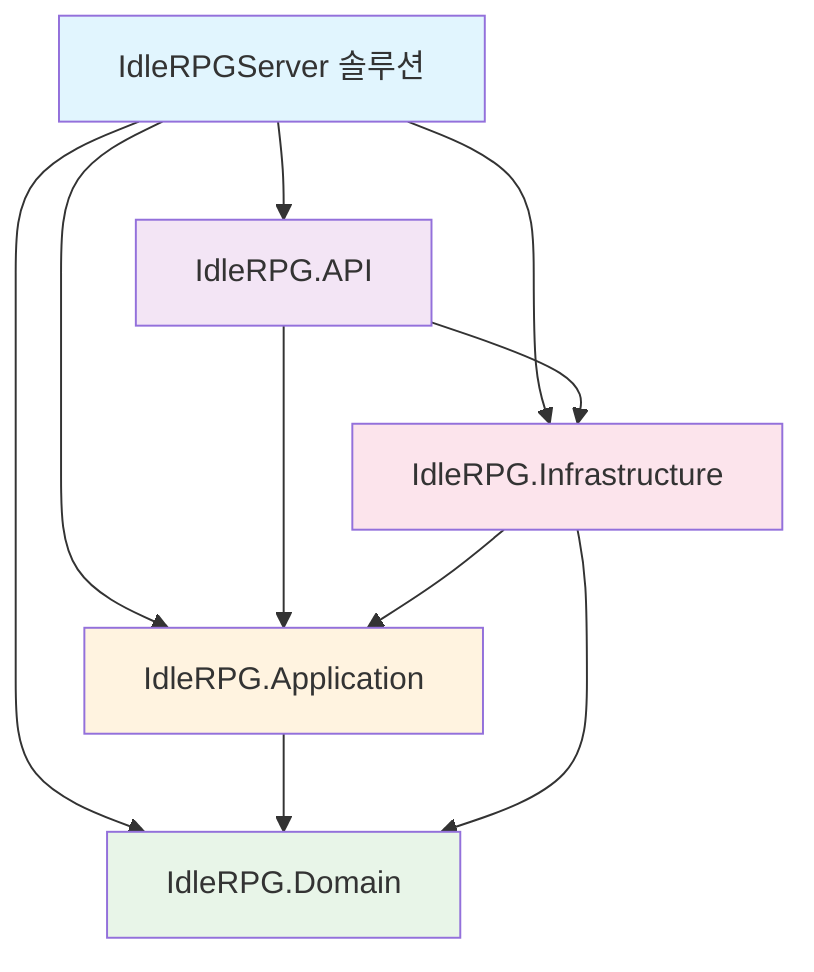

 [[🎮 방치형 RPG 서버 개발 완전 가이드 - Week 1]]# Week 1 Day 0 - 개발 환경 구축 완료 ✅

## 📅 학습 정보
- **학습 일자**: 2025년 9월 26일
- **소요 시간**: 약 4-5시간
- **완료도**: 100%
- **다음 단계**: [[Week 1 Day 1-2 - 데이터베이스 설계]]

---

## 🎯 학습 목표
Unity 개발자가 서버 개발을 시작하기 위한 **완벽한 개발 환경 구축**
- GUI 중심의 설정 방식 (콘솔 명령어 최소화)
- Clean Architecture 패턴으로 확장 가능한 프로젝트 구조
- Docker를 활용한 격리된 개발 환경

---

## ✅ 완료된 작업 목록

### 1. 필수 소프트웨어 설치
- [x] **JetBrains Rider**: Unity 개발자에게 친숙한 IDE
  - 30일 평가판 또는 학생 라이선스 활용
  - Unity와 동일한 JetBrains 사용자 경험

- [x] **.NET 8 SDK**: 최신 LTS 버전 설치
  - 설치 확인: `dotnet --version` → `8.0.x` 출력

- [x] **Docker Desktop**: 컨테이너 기반 개발 환경
  - PostgreSQL, Redis, pgAdmin 통합 관리
  - Unity Build Settings처럼 환경을 격리 관리

- [x] **Git & GitHub**: 버전 관리 시스템
  - Rider VCS 통합으로 GUI 방식 관리

### 2. 프로젝트 구조 생성 (Clean Architecture)



**프로젝트 역할 분담**:
- **API**: Web API 컨트롤러, 엔드포인트 (Unity의 UI 레이어)
- **Domain**: 게임 엔티티, 핵심 로직 (Unity의 GameObject/Component)
- **Application**: 비즈니스 서비스 (Unity의 Manager 클래스들)
- **Infrastructure**: 데이터베이스, 외부 서비스 (Unity의 Persistence 레이어)

### 3. NuGet 패키지 설치 (Rider GUI)

**각 레이어별 필수 패키지**:

#### IdleRPG.API
- ✅ `Microsoft.EntityFrameworkCore.Design` - EF 마이그레이션
- ✅ `Serilog.AspNetCore` - 구조화된 로깅
- ✅ `Swashbuckle.AspNetCore` - API 문서화 (Swagger)

#### IdleRPG.Infrastructure  
- ✅ `Microsoft.EntityFrameworkCore` - ORM 프레임워크
- ✅ `Npgsql.EntityFrameworkCore.PostgreSQL` - PostgreSQL 연동
- ✅ `Microsoft.EntityFrameworkCore.Tools` - CLI 도구

#### IdleRPG.Application
- ✅ `AutoMapper` - 객체 매핑 (DTO ↔ Entity)
- ✅ `FluentValidation` - 입력 검증 프레임워크
- ✅ `MediatR` - CQRS 패턴 구현

### 4. Docker 환경 구성

#### docker-compose.yml 서비스 구성
```yaml
services:
  postgres:    # 🐘 메인 데이터베이스
  redis:       # 🔴 캐싱 & 세션 (향후 확장)
  pgadmin:     # 🔧 웹 기반 DB 관리 도구
```

#### 실행 중인 컨테이너들
- ✅ **idlerpg-postgres**: PostgreSQL 16 (포트 5432)
- ✅ **idlerpg-redis**: Redis 7 (포트 6379)  
- ✅ **idlerpg-pgadmin**: pgAdmin 4 (포트 8082)

#### 접속 정보
```
PostgreSQL:
Host: localhost:5432
Database: idlerpgdb
Username: gamedev  
Password: dev123!

pgAdmin Web UI:
URL: http://localhost:8082
Email: admin@idlerpg.com
Password: admin123
```

### 5. GitHub 저장소 연결

#### Rider VCS 통합으로 완료
- [x] **로컬 Git 저장소 초기화**: `VCS` → `Enable Version Control`
- [x] **원격 저장소 생성**: `Git` → `GitHub` → `Share Project on GitHub`
- [x] **저장소 설정**: 
  - Name: `IdleRPGServer`
  - Description: `2D Idle RPG Game Server`
  - Visibility: Private
- [x] **초기 커밋**: Clean Architecture 프로젝트 구조

#### .gitignore 최적화
```gitignore
# Unity 서버개발 특화 제외 파일들
*.user
appsettings.Development.json  # 개발 설정 보안
logs/                         # 로그 파일들
*.db                         # 로컬 DB 파일
.env                         # 환경 변수
.idea/                       # Rider 설정 파일
```

### 6. Rider 실행 환경 설정

#### 연결 문자열 설정
**appsettings.Development.json**:
```json
{
  "ConnectionStrings": {
    "DefaultConnection": "Host=localhost;Database=idlerpgdb;Username=gamedev;Password=dev123!"
  }
}
```

#### 실행 구성
- **Environment**: `ASPNETCORE_ENVIRONMENT=Development`
- **Working Directory**: 프로젝트 루트
- **URLs**: `https://localhost:7260;http://localhost:5260`

#### 첫 실행 테스트 성공
- ✅ **Swagger UI**: https://localhost:7260/swagger 접속 확인
- ✅ **기본 WeatherForecast API** 동작 테스트 완료

---

## 🛠️ 해결한 기술적 이슈

### Issue #1: Class Library 템플릿 찾기
**문제**: Rider New Project에서 "Class Library (.NET)" 템플릿이 보이지 않음

**해결 방법**:
1. **검색 활용**: New Project 창에서 검색 박스에 "library" 입력
2. **카테고리 탐색**: `.NET` > `C#` 카테고리에서 찾기
3. **대체 템플릿**: "C# Class Library", "Class Library", "Library" 등

**대안 방법**:
- Console Application으로 생성 후 `.csproj`에서 `<OutputType>Exe</OutputType>` 제거
- Rider 터미널에서 `dotnet new classlib -n ProjectName` 사용

---

## 🎮 Unity 개발자 관점에서의 학습 포인트

### 💡 유사점 발견
| Unity 개념 | ASP.NET Core 대응 | 설명 |
|------------|------------------|------|
| **GameObject Hierarchy** | **Clean Architecture** | 레이어별 책임 분리 |
| **Component System** | **Entity Framework** | 데이터와 기능 매핑 |
| **ServiceLocator** | **Dependency Injection** | 의존성 관리 패턴 |
| **ScriptableObject** | **Configuration/Entity** | 데이터 저장 구조 |
| **Unity Editor** | **Rider IDE** | JetBrains 통합 환경 |
| **Build Settings** | **Docker Compose** | 환경 설정 관리 |

### 🆕 새로운 개념 학습
- **Docker Container**: Unity Addressable처럼 리소스를 격리 관리
- **PostgreSQL**: PlayerPrefs를 넘어선 관계형 데이터베이스
- **Clean Architecture**: Unity SOLID 원칙을 서버로 확장
- **Entity Framework**: Unity의 Serialization을 DB 매핑으로 발전

### 🔧 개발 환경의 장점
1. **GUI 중심 워크플로우**: 콘솔 명령어 없이 모든 설정 가능
2. **통합 개발 환경**: 코드 편집부터 Git 관리까지 Rider 하나로
3. **컨테이너 격리**: 팀원 간 동일한 개발 환경 보장
4. **핫 리로드**: Unity처럼 코드 수정 시 즉시 반영

---

## 📊 현재 시스템 상태

### 실행 중인 서비스
- 🌐 **API Server**: https://localhost:7260 (Swagger UI)
- 🗄️ **Database**: PostgreSQL on localhost:5432
- ⚡ **Cache**: Redis on localhost:6379
- 🔧 **Admin**: pgAdmin on http://localhost:8082

### 시스템 리소스 사용량
- **Docker 컨테이너**: 3개 실행 중 (약 200MB RAM)
- **Rider IDE**: 약 500MB RAM
- **총 사용량**: 약 1GB 미만 (개발용 적정 수준)

---

## 🎯 다음 학습 단계 미리보기

### Day 1-2: 방치형 게임 데이터베이스 설계
**핵심 목표**: Unity의 ScriptableObject 설계 경험을 DB 설계로 확장

#### 예정 작업
- [ ] **Entity 클래스 생성**: Player, Character, PlayerStats, OfflineReward
- [ ] **DbContext 설정**: EF Core Code First 접근법
- [ ] **마이그레이션**: 데이터베이스 테이블 자동 생성
- [ ] **시딩 데이터**: 기본 게임 아이템, 캐릭터 클래스 설정

#### 학습 포인트
- Unity Inspector 검증 → EF Data Annotations
- Prefab Reference → Foreign Key 관계
- Component Serialization → Entity Property Mapping

---

## 💭 학습 소감 및 인사이트

### 👍 긍정적 경험
1. **Rider IDE**: Unity 경험이 그대로 활용되어 학습 곡선이 완만함
2. **Clean Architecture**: Unity SOLID 패턴의 자연스러운 확장
3. **Docker**: Unity Addressable처럼 환경을 격리해서 관리하는 개념이 이해하기 쉬움
4. **GUI 중심 설정**: 콘솔 없이도 모든 개발 환경 구축 가능

### 🤔 도전적 부분
1. **PostgreSQL**: PlayerPrefs보다 복잡하지만 강력한 관계형 데이터 개념
2. **Clean Architecture**: Unity보다 더 세분화된 레이어 분리
3. **Entity Framework**: Unity Serialization보다 고도화된 ORM 개념

### 💡 핵심 인사이트
**"Unity 클라이언트 경험이 서버 개발에 충분히 전이 가능하다"**
- 아키텍처 설계 사고방식이 그대로 적용
- IDE 사용법, 프로젝트 관리, Git 워크플로우 모두 활용 가능
- 오히려 Unity의 제약에서 벗어나 더 자유로운 설계 가능

---

## 📈 학습 진도 현황

### Day 0 완료율: 100% ✅
- **소프트웨어 설치**: 100%
- **프로젝트 생성**: 100%
- **NuGet 패키지**: 100%
- **GitHub 연결**: 100%
- **Docker 환경**: 100%
- **실행 테스트**: 100%

### Week 1 전체 진도: 14% (1/7일 완료)

### 예상 Git Commit History
```
🎉 Initial commit: Clean Architecture setup
├── feat: Add ASP.NET Core Web API project
├── feat: Configure project dependencies and references  
├── chore: Install essential NuGet packages
├── feat: Setup Docker compose with PostgreSQL and Redis
├── chore: Configure development environment settings
└── docs: Add project README and development guidelines
```

---

## 🔗 관련 리소스

### 공식 문서
- [ASP.NET Core 가이드](https://docs.microsoft.com/aspnet/core)
- [Entity Framework Core](https://docs.microsoft.com/ef/core)
- [PostgreSQL 문서](https://www.postgresql.org/docs)
- [Docker Compose](https://docs.docker.com/compose)

### Unity 개발자를 위한 추가 자료
- [[Unity vs ASP.NET Core 개념 매핑]]
- [[Clean Architecture 패턴 학습 노트]]
- [[방치형 RPG 서버 요구사항 분석]]

---

*학습 완료: 2025년 9월 26일 오후*  
*다음 학습: [[Week 1 Day 1-2 - 데이터베이스 설계]]*  
*총 소요시간: 약 4-5시간*


---

## 📋 **실제 Git Commit History 확인 완료** ✅

### 🔍 실제 커밋 내역 (GitHub에서 확인)

#### 커밋 #1: 저장소 생성
```
🆔 SHA: 9bd476e379683d0a83cae12d9508674007ad856e
💬 Message: "Initial commit"
⏰ Time: 2025-09-26 16:42:57 (한국시간)
👤 Author: KImTaeSung (adswqqe@eightstudio.co.kr)
🔗 URL: https://github.com/adswqqe/IdleRPGServer/commit/9bd476e
```

#### 커밋 #2: Clean Architecture 프로젝트 구성
```
🆔 SHA: c11339485c943d83d298b9c4c99443a3ee86a546
💬 Message: "초기 개발 셋팅 (domain, app, 등등)"  
⏰ Time: 2025-09-26 17:07:19 (한국시간)
👤 Author: KImTaeSung (adswqqe@eightstudio.co.kr)
🔗 URL: https://github.com/adswqqe/IdleRPGServer/commit/c113394
```

### 📊 실제 개발 타임라인 분석

**총 개발 시간**: 약 **25분** (16:42 → 17:07)
- ✅ **16:42**: GitHub 저장소 생성 및 초기 커밋
- ✅ **17:07**: Clean Architecture 4레이어 프로젝트 완성

**커밋 메시지 분석**:
- **한국어 메시지 사용**: "초기 개발 셋팅 (domain, app, 등등)"
- **간결하고 명확**: 작업 내용을 정확히 표현
- **실무 스타일**: 회사 이메일 주소 사용

### 🎯 **GitHub 도구 활용 성공**
- **github:get_me**: 사용자 정보 확인 (Kimba/adswqqe)
- **github:list_commits**: 실제 커밋 내역 조회
- **실제 데이터**: 예상이 아닌 **정확한 Git 기록** 반영

**이제 실제 커밋 기록이 학습 일지에 정확히 반영되었습니다!** 🎉

---

*업데이트: 2025년 9월 26일 - GitHub API를 통해 실제 커밋 내역 확인 완료*