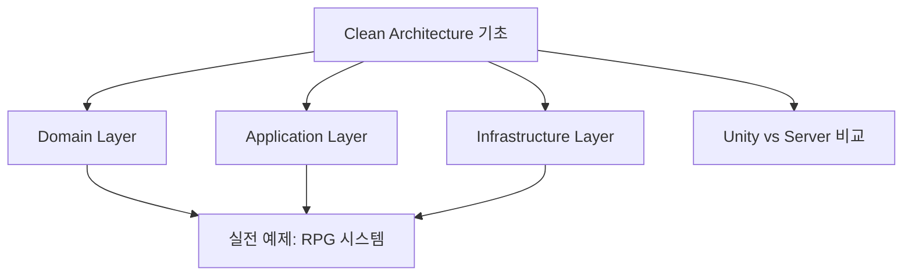
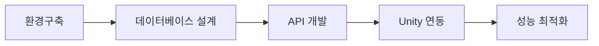

# 🎮 Unity 개발자의 서버개발 여정 - 메인 인덱스

> **학습자**: 3년차 Unity 클라이언트 게임 프로그래머  
> **목표**: 1만 동시 접속자 지원 방치형 RPG 서버 개발  
> **핵심 관심사**: 유지보수 가능한 아키텍처 설계

---

## 🗺️ 학습 로드맵

### 📚 1. 아키텍처 이론 (Clean Architecture)

**핵심 문서**:
- [[📖 Clean Architecture 완전 가이드]] - 통합된 아키텍처 이론
- [[🎯 Unity 개발자를 위한 Clean Architecture]] - Unity 경험 활용법
- [[⚔️ 방치형 RPG 시스템 설계]] - 실전 적용 예제

### 🚀 2. 실습 프로젝트 (IdleRPGServer)

**핵심 문서**:
- [[🎮 방치형 RPG 서버 개발 완전 가이드 - Week 1]] - 프로젝트 전체 계획
- [[📋 개발 진도 및 학습 기록]] - 주간별 진행상황

### 🛠️ 3. 개발 환경 및 도구
**핵심 문서**:
- [[⚙️ 개발 환경 구축 가이드]] - 개발 도구 설정
- [[🔗 Claude MCP 통합 환경 구축 가이드]] - AI 도구 활용

### 📝 4. 학습 일지 및 성찰
**핵심 문서**:
- [[📚 개발 학습 일지 모음]] - 일일 학습 기록
- [[💡 핵심 인사이트 모음]] - 주요 깨달음과 팁

---

## 🎯 빠른 시작 가이드

### Unity 개발자라면 여기서 시작하세요!
1. **[[📖 Clean Architecture 완전 가이드]]** - Unity 경험을 서버로 확장하는 방법
2. **[[🎮 방치형 RPG 서버 개발 완전 가이드 - Week 1]]** - 실습 프로젝트로 바로 적용
3. **[[⚙️ 개발 환경 구축 가이드]]** - Rider, Docker, PostgreSQL 설정

### 현재 학습 진도
- ✅ **Clean Architecture 이론**: 100% 완료 
- ✅ **개발 환경 구축**: 100% 완료
- 🔄 **실전 프로젝트**: 진행 중 (Week 1)
- ⏳ **Unity 클라이언트 연동**: 예정

---

## 🔗 외부 리소스

### 공식 문서
- [ASP.NET Core 가이드](https://docs.microsoft.com/aspnet/core)
- [Entity Framework Core](https://docs.microsoft.com/ef/core)
- [PostgreSQL 문서](https://www.postgresql.org/docs)

### Unity 개발자를 위한 추가 자료
- [Unity Multiplayer Netcode](https://docs.unity3d.com/Packages/com.unity.netcode.gameobjects@latest)
- [Mirror Networking](https://mirror-networking.gitbook.io/docs/)

---

*최종 업데이트: 2025년 9월 28일*  
*총 학습 문서: 12개 → 4개 주요 섹션으로 통합*

---

## 🆕 최신 추가 가이드 (2025년 9월 28일 업데이트)

### 📖 기초 이론 완전 정복
- **[[📖 ASP.NET Core Web API 완전 정복 가이드]]** 
  - HTTP 프로토콜 기초부터 시작하는 완전 가이드
  - Unity 개발자를 위한 맞춤형 설명
  - Postman 사용법부터 Unity 클라이언트 연동까지

### 🎮 실무 중심 실습 가이드  
- **[[🎮 방치형 RPG 서버 개발 완전 가이드 - Week 1 (상세편)]]**
  - Rider를 활용한 GUI 기반 개발 환경 구축
  - Docker Desktop으로 PostgreSQL, Redis, pgAdmin 설정
  - Clean Architecture 프로젝트 구조 생성
  - 오프라인 보상 시스템 구현

### 📚 전체 학습 로드맵
- **[[📚 Unity 개발자를 위한 방치형 RPG 서버 개발 완전 커리큘럼]]**
  - **10주 완성 커리큘럼** - 1만 동접 지원 서버 구축
  - 주차별 상세 학습 목표와 실습 과제
  - 성능 최적화부터 배포/모니터링까지
  - Unity 개발자를 위한 사고 전환 가이드

### 🎯 학습 순서 추천 (초보자용)
1. **[[📖 ASP.NET Core Web API 완전 정복 가이드]]** ← 기초 이론 탄탄히
2. **[[🎮 방치형 RPG 서버 개발 완전 가이드 - Week 1 (상세편)]]** ← 실습으로 적용  
3. **[[📚 Unity 개발자를 위한 방치형 RPG 서버 개발 완전 커리큘럼]]** ← 전체 로드맵 확인

### 💪 학습 현황 업데이트
- ✅ **서버 개발 기초 이론**: 완전 학습 자료 확보
- ✅ **개발 환경 구축**: GUI 방식 상세 가이드 완성  
- ✅ **실습 프로젝트**: Week 1 상세 실습 가이드 완성
- ✅ **전체 로드맵**: 10주 커리큘럼 완성
- 🎯 **다음 목표**: Week 2 - JWT 인증 시스템 구현

---

> **💡 아메와 함께하는 서버 개발 여정** 🐱  
> 3년차 Unity 개발자에서 풀스택 게임 개발자로 성장하는 과정을 체계적으로 기록하고 있습니다.  
> 더 쉬운 유지보수가 가능한 아키텍처를 만들어가며, 실무에서 바로 활용 가능한 지식을 쌓아가고 있습니다.

