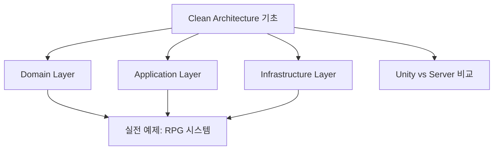
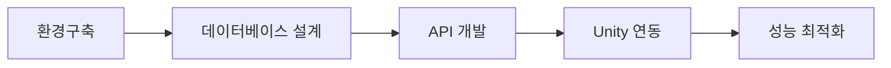

# 🎮 Unity 개발자의 서버개발 여정 - 메인 인덱스

> **학습자**: 3년차 Unity 클라이언트 게임 프로그래머  
> **목표**: 1만 동시 접속자 지원 방치형 RPG 서버 개발  
> **핵심 관심사**: 유지보수 가능한 아키텍처 설계

---

## 🗺️ 학습 로드맵

### 📚 1. 아키텍처 이론 (Clean Architecture)

**핵심 문서**:
- [[📖 Clean Architecture 완전 가이드]] - 통합된 아키텍처 이론
- [[🎯 Unity 개발자를 위한 Clean Architecture]] - Unity 경험 활용법
- [[⚔️ 방치형 RPG 시스템 설계]] - 실전 적용 예제

### 🚀 2. 실습 프로젝트 (IdleRPGServer)

**핵심 문서**:
- [[🎮 방치형 RPG 서버 개발 완전 가이드 - Week 1]] - 프로젝트 전체 계획
- [[📋 개발 진도 및 학습 기록]] - 주간별 진행상황

### 🛠️ 3. 개발 환경 및 도구
**핵심 문서**:
- [[⚙️ 개발 환경 구축 가이드]] - 개발 도구 설정
- [[🔗 Claude MCP 통합 환경 구축 가이드]] - AI 도구 활용

### 📝 4. 학습 일지 및 성찰
**핵심 문서**:
- [[📚 개발 학습 일지 모음]] - 일일 학습 기록
- [[💡 핵심 인사이트 모음]] - 주요 깨달음과 팁

---

## 🎯 빠른 시작 가이드

### Unity 개발자라면 여기서 시작하세요!
1. **[[📖 Clean Architecture 완전 가이드]]** - Unity 경험을 서버로 확장하는 방법
2. **[[🎮 방치형 RPG 서버 개발 완전 가이드 - Week 1]]** - 실습 프로젝트로 바로 적용
3. **[[⚙️ 개발 환경 구축 가이드]]** - Rider, Docker, PostgreSQL 설정

### 현재 학습 진도
- ✅ **Clean Architecture 이론**: 100% 완료 
- ✅ **개발 환경 구축**: 100% 완료
- 🔄 **실전 프로젝트**: 진행 중 (Week 1)
- ⏳ **Unity 클라이언트 연동**: 예정

---

## 🔗 외부 리소스

### 공식 문서
- [ASP.NET Core 가이드](https://docs.microsoft.com/aspnet/core)
- [Entity Framework Core](https://docs.microsoft.com/ef/core)
- [PostgreSQL 문서](https://www.postgresql.org/docs)

### Unity 개발자를 위한 추가 자료
- [Unity Multiplayer Netcode](https://docs.unity3d.com/Packages/com.unity.netcode.gameobjects@latest)
- [Mirror Networking](https://mirror-networking.gitbook.io/docs/)

---

*최종 업데이트: 2025년 9월 28일*  
*총 학습 문서: 12개 → 4개 주요 섹션으로 통합*
