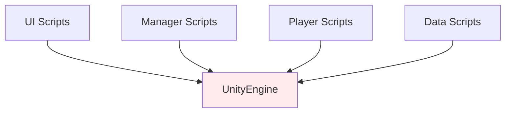
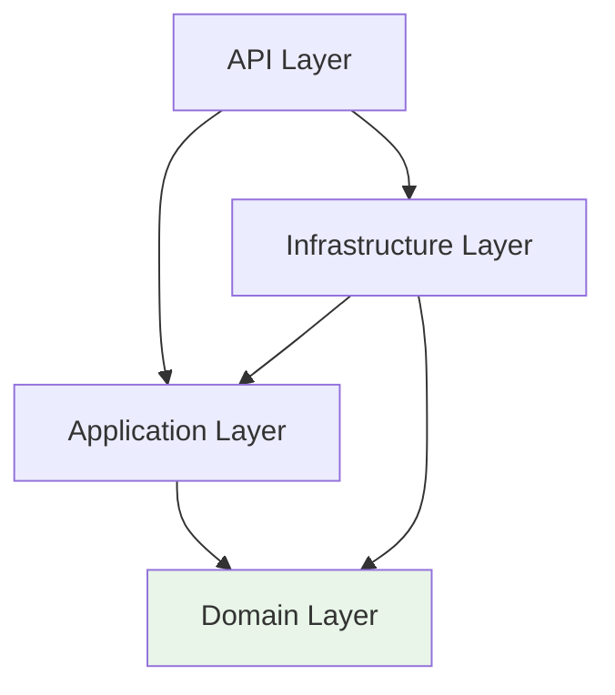

# 📖 Clean Architecture 완전 가이드 - Unity 개발자를 위한 서버 아키텍처

> **대상**: 3년차 Unity 클라이언트 게임 프로그래머  
> **목표**: Unity 경험을 바탕으로 Clean Architecture 완전 이해  
> **핵심**: 더 쉬운 유지보수가 가능한 아키텍처 설계

---

## 🎯 왜 Clean Architecture인가?

Unity에서 3년간 개발하시면서 이런 경험 있으시죠?
- **코드 수정 시 연쇄 에러**: 한 스크립트 수정했는데 다른 곳에서 오류 발생
- **테스트의 어려움**: PlayMode 테스트만 가능하고 Unit 테스트는 복잡함
- **플랫폼별 대응**: Android/iOS/PC 빌드마다 다른 처리 필요

Clean Architecture는 이런 문제들을 **레이어 분리**와 **의존성 역전**으로 해결합니다. Unity 경험이 있으시기 때문에 오히려 더 쉽게 이해하실 수 있습니다.

---

## 🏗️ Clean Architecture 핵심 구조

### Unity vs Clean Architecture 매핑

| Unity 개념 | Clean Architecture | 역할 |
|------------|-------------------|------|
| **GameObject** | **Domain Entity** | 게임 객체의 핵심 로직 |
| **Manager 클래스** | **Application Service** | 시스템 간 조율 |
| **Unity Services** | **Infrastructure** | 외부 시스템 연결 |
| **UI System** | **Presentation Layer** | 사용자 인터페이스 |

### 의존성 방향 비교

**Unity의 문제점** (모든 것이 UnityEngine에 의존):


**Clean Architecture의 해결** (Domain 중심의 단방향 의존성):


---

## 🎮 Domain Layer: 게임의 핵심 로직

Domain Layer는 Unity의 GameObject/Component와 같은 역할을 합니다. 외부 의존성 없이 순수한 게임 로직만 담당합니다.

### 핵심 원칙
- **외부 의존성 없음**: Unity Engine이나 데이터베이스에 의존하지 않음
- **순수한 C# 코드**: 비즈니스 규칙만 포함
- **테스트 용이성**: 독립적으로 유닛 테스트 가능

### 방치형 RPG 예제: Player 엔티티

```csharp
// Unity Component 방식 (문제가 있는 코드)
public class PlayerComponent : MonoBehaviour
{
    public int health = 100;
    public int level = 1;
    
    void LevelUp()
    {
        level++;
        health += 20;
        // 여기서 UI 업데이트, 사운드 재생 등이 섞임
        UIManager.Instance.UpdateLevel(level);
        AudioSource.Play(levelUpSound);
    }
}

// Clean Architecture Domain Entity (개선된 코드)
public class Player
{
    public int Health { get; private set; } = 100;
    public int Level { get; private set; } = 1;
    public DateTime LastLogin { get; set; } = DateTime.UtcNow;
    
    // 생성자에서 비즈니스 규칙 적용
    public Player(string username, string email)
    {
        if (string.IsNullOrWhiteSpace(username))
            throw new ArgumentException("Username cannot be empty");
        if (!IsValidEmail(email))
            throw new ArgumentException("Invalid email format");
            
        Username = username;
        Email = email;
    }
    
    // 순수한 비즈니스 로직만 포함
    public void LevelUp()
    {
        Level++;
        Health += 20; // 레벨업 시 체력 증가 규칙
    }
    
    // 방치형 게임 특화: 오프라인 시간 계산
    public TimeSpan GetOfflineTime()
    {
        return DateTime.UtcNow - LastLogin;
    }
    
    private bool IsValidEmail(string email)
    {
        return email.Contains("@") && email.Contains(".");
    }
}
```

### 방치형 게임 핵심: OfflineReward 엔티티

```csharp
public class OfflineReward
{
    public Guid Id { get; private set; } = Guid.NewGuid();
    public Guid PlayerId { get; private set; }
    public DateTime OfflineStart { get; private set; }
    public DateTime OfflineEnd { get; private set; }
    public long CalculatedGold { get; private set; }
    public long CalculatedExperience { get; private set; }
    public decimal BonusMultiplier { get; private set; } = 1.0m;
    public bool IsClaimed { get; private set; } = false;
    
    public OfflineReward(Guid playerId, DateTime offlineStart, DateTime offlineEnd, int playerLevel)
    {
        PlayerId = playerId;
        OfflineStart = offlineStart;
        OfflineEnd = offlineEnd;
        
        // 방치형 게임 핵심 로직: 오프라인 보상 계산
        CalculateRewards(playerLevel);
    }
    
    // 도메인 로직: 오프라인 보상 계산 (방치형 게임 핵심!)
    private void CalculateRewards(int playerLevel)
    {
        var offlineTime = OfflineEnd - OfflineStart;
        
        // 최대 12시간까지만 보상 (방치형 게임 밸런싱)
        var rewardHours = Math.Min(offlineTime.TotalHours, 12.0);
        
        // 레벨에 비례한 시간당 보상
        var hourlyGold = playerLevel * 100;
        var hourlyExp = playerLevel * 50;
        
        CalculatedGold = (long)(rewardHours * hourlyGold * BonusMultiplier);
        CalculatedExperience = (long)(rewardHours * hourlyExp * BonusMultiplier);
    }
    
    // 도메인 로직: 보상 수령
    public void Claim()
    {
        if (IsClaimed)
            throw new InvalidOperationException("Reward already claimed");
            
        IsClaimed = true;
    }
    
    // 도메인 로직: 보너스 적용
    public void ApplyBonus(decimal multiplier)
    {
        if (IsClaimed)
            throw new InvalidOperationException("Cannot apply bonus to claimed reward");
            
        BonusMultiplier = multiplier;
        
        // 보상 재계산
        CalculatedGold = (long)(CalculatedGold / BonusMultiplier * multiplier);
        CalculatedExperience = (long)(CalculatedExperience / BonusMultiplier * multiplier);
        BonusMultiplier = multiplier;
    }
}
```

---

## ⚙️ Application Layer: 시스템 조율자

Application Layer는 Unity의 Manager 클래스들(GameManager, UIManager)과 같은 역할을 합니다. 여러 Domain 엔티티들을 조합해서 복잡한 비즈니스 시나리오를 구현합니다.

### 핵심 특징
- **유스케이스 구현**: "플레이어 생성", "오프라인 보상 계산" 등의 비즈니스 시나리오
- **Domain 조율**: 여러 Domain 엔티티들을 조합해서 복잡한 로직 수행
- **인터페이스 정의**: Infrastructure가 구현해야 할 계약 명시

### Unity Manager vs Application Service 비교

```csharp
// Unity Manager 방식 (문제가 있는 코드)
public class GameManager : MonoBehaviour
{
    public static GameManager Instance;
    
    void Awake() { Instance = this; }
    
    public void CreatePlayer(string name)
    {
        var player = Instantiate(playerPrefab);
        player.name = name;
        SavePlayerData(player); // 저장 로직이 섞임
        UIManager.Instance.ShowWelcome(); // UI 로직이 섞임
    }
}

// Application Service 방식 (개선된 코드)
public class PlayerService : IPlayerService
{
    private readonly IPlayerRepository _playerRepository;
    private readonly ILogger<PlayerService> _logger;
    
    public PlayerService(IPlayerRepository playerRepository, ILogger<PlayerService> logger)
    {
        _playerRepository = playerRepository;
        _logger = logger;
    }
    
    public async Task<PlayerDto> CreatePlayerAsync(CreatePlayerDto request)
    {
        _logger.LogInformation($"Creating new player: {request.Username}");
        
        // 1. 비즈니스 규칙 검증
        if (await _playerRepository.UsernameExistsAsync(request.Username))
        {
            throw new DuplicateException($"Username '{request.Username}' already exists");
        }
        
        // 2. Domain 엔티티 생성 (비즈니스 로직 위임)
        var player = new Player(request.Username, request.Email);
        
        // 3. 영속성 처리 (Infrastructure에 위임)
        await _playerRepository.AddAsync(player);
        
        // 4. DTO 변환 후 반환
        _logger.LogInformation($"Player created successfully: {player.Id}");
        return _mapper.Map<PlayerDto>(player);
    }
}
```

### 방치형 게임 핵심: OfflineRewardService

```csharp
public class OfflineRewardService : IOfflineRewardService
{
    private readonly IPlayerRepository _playerRepository;
    private readonly ICharacterRepository _characterRepository;
    private readonly IOfflineRewardRepository _rewardRepository;
    
    public async Task<OfflineRewardDto> CalculateOfflineRewardAsync(Guid playerId)
    {
        // 1. 플레이어 정보 조회
        var player = await _playerRepository.GetByIdAsync(playerId);
        if (player == null)
            throw new NotFoundException("Player not found");
        
        // 2. 메인 캐릭터 조회 (보상 계산을 위해)
        var mainCharacter = await _characterRepository.GetMainCharacterAsync(playerId);
        if (mainCharacter == null)
            throw new InvalidOperationException("No main character found");
        
        // 3. 이미 계산된 미수령 보상이 있는지 확인
        var existingReward = await _rewardRepository.GetPendingRewardAsync(playerId);
        if (existingReward != null)
            return _mapper.Map<OfflineRewardDto>(existingReward);
        
        // 4. Domain 로직으로 새 보상 계산
        var offlineStart = player.LastLogin;
        var offlineEnd = DateTime.UtcNow;
        var offlineReward = new OfflineReward(playerId, offlineStart, offlineEnd, mainCharacter.Level);
        
        // 5. VIP 보너스 적용 (비즈니스 로직)
        if (await IsVipPlayerAsync(playerId))
        {
            offlineReward.ApplyBonus(1.5m); // 50% 보너스
        }
        
        // 6. 보상 저장
        await _rewardRepository.AddAsync(offlineReward);
        
        return _mapper.Map<OfflineRewardDto>(offlineReward);
    }
    
    // 트랜잭션을 사용한 보상 수령 처리
    public async Task<OfflineRewardDto> ClaimOfflineRewardAsync(Guid playerId, Guid rewardId)
    {
        using var transaction = await _rewardRepository.BeginTransactionAsync();
        
        try
        {
            // 1. 보상 조회 및 Domain 로직으로 수령 처리
            var reward = await _rewardRepository.GetByIdAsync(rewardId);
            reward.Claim(); // 도메인 규칙 적용
            
            // 2. 플레이어와 캐릭터에 보상 적용
            var player = await _playerRepository.GetByIdAsync(playerId);
            var mainCharacter = await _characterRepository.GetMainCharacterAsync(playerId);
            
            mainCharacter.GainExperience(reward.CalculatedExperience);
            player.UpdateLastLogin();
            
            // 3. 모든 변경사항 저장
            await _rewardRepository.UpdateAsync(reward);
            await _playerRepository.UpdateAsync(player);
            await _characterRepository.UpdateAsync(mainCharacter);
            
            await transaction.CommitAsync();
            return _mapper.Map<OfflineRewardDto>(reward);
        }
        catch
        {
            await transaction.RollbackAsync();
            throw;
        }
    }
}
```

---

## 🔧 Infrastructure Layer: 외부 세계와의 연결

Infrastructure Layer는 Unity의 Services(Networking, Analytics, CloudSave)와 같은 역할을 합니다. 외부 시스템과의 연결을 담당하고, Application Layer에서 정의한 인터페이스를 실제로 구현합니다.

### 핵심 특징
- **외부 의존성 처리**: 데이터베이스, 파일 시스템, 웹 API, 캐시 등
- **인터페이스 구현**: Application Layer에서 정의한 계약을 실제로 구현
- **기술적 세부사항**: ORM, HTTP 클라이언트, 메시지 큐 등

### Repository 패턴 구현

```csharp
// Unity 저장 방식 (제한적)
public class SaveManager : MonoBehaviour
{
    public void SavePlayerData(PlayerData data)
    {
        string json = JsonUtility.ToJson(data);
        PlayerPrefs.SetString("PlayerData", json);
        PlayerPrefs.Save();
    }
    
    public PlayerData LoadPlayerData()
    {
        string json = PlayerPrefs.GetString("PlayerData");
        return JsonUtility.FromJson<PlayerData>(json);
    }
}

// Repository 패턴 (확장 가능)
public class PlayerRepository : IPlayerRepository
{
    private readonly GameDbContext _context;
    private readonly ICacheService _cache;
    
    public async Task<Player> GetByIdAsync(Guid id)
    {
        // 1. 캐시에서 먼저 확인 (Unity의 Object Pool과 유사한 개념)
        var cacheKey = $"player:{id}";
        var cachedPlayer = await _cache.GetAsync<Player>(cacheKey);
        if (cachedPlayer != null)
            return cachedPlayer;
        
        // 2. 데이터베이스에서 조회
        var player = await _context.Players
            .Include(p => p.Characters.Where(c => c.IsMain)) // 메인 캐릭터만 로드
            .FirstOrDefaultAsync(p => p.Id == id);
            
        if (player != null)
        {
            // 3. 캐시에 저장 (5분간)
            await _cache.SetAsync(cacheKey, player, TimeSpan.FromMinutes(5));
        }
        
        return player;
    }
    
    public async Task<List<Player>> GetTopPlayersByLevelAsync(int count)
    {
        // 1만 동접 고려: 복잡한 쿼리는 캐시 활용
        var cacheKey = $"leaderboard:top{count}";
        var cachedResult = await _cache.GetAsync<List<Player>>(cacheKey);
        if (cachedResult != null)
            return cachedResult;
        
        var topPlayers = await _context.Players
            .Join(_context.Characters.Where(c => c.IsMain),
                  p => p.Id,
                  c => c.PlayerId,
                  (p, c) => new { Player = p, Character = c })
            .OrderByDescending(pc => pc.Character.Level)
            .ThenByDescending(pc => pc.Character.Experience)
            .Take(count)
            .Select(pc => pc.Player)
            .ToListAsync();
            
        // 랭킹은 자주 변하지 않으므로 10분간 캐시
        await _cache.SetAsync(cacheKey, topPlayers, TimeSpan.FromMinutes(10));
        
        return topPlayers;
    }
}
```

### 백그라운드 작업 시스템 (방치형 게임 핵심)

```csharp
public class OfflineRewardBackgroundService : BackgroundService
{
    private readonly IServiceProvider _serviceProvider;
    
    protected override async Task ExecuteAsync(CancellationToken stoppingToken)
    {
        while (!stoppingToken.IsCancellationRequested)
        {
            try
            {
                await ProcessOfflineRewards();
                
                // 5분마다 실행 (Unity의 InvokeRepeating과 유사)
                await Task.Delay(TimeSpan.FromMinutes(5), stoppingToken);
            }
            catch (Exception ex)
            {
                _logger.LogError(ex, "Error in offline reward background service");
                await Task.Delay(TimeSpan.FromMinutes(1), stoppingToken);
            }
        }
    }
    
    private async Task ProcessOfflineRewards()
    {
        using var scope = _serviceProvider.CreateScope();
        var context = scope.ServiceProvider.GetRequiredService<GameDbContext>();
        var rewardService = scope.ServiceProvider.GetRequiredService<IOfflineRewardService>();
        
        // 5분 이상 오프라인인 플레이어들 조회
        var cutoffTime = DateTime.UtcNow.AddMinutes(-5);
        var offlinePlayers = await context.Players
            .Where(p => p.LastLogin < cutoffTime && p.IsActive)
            .Take(100) // 배치 크기 제한 (성능 고려)
            .ToListAsync();
            
        foreach (var player in offlinePlayers)
        {
            try
            {
                // 이미 계산된 미수령 보상이 있는지 확인
                var hasPendingReward = await context.OfflineRewards
                    .AnyAsync(r => r.PlayerId == player.Id && !r.IsClaimed);
                    
                if (!hasPendingReward)
                {
                    await rewardService.CalculateOfflineRewardAsync(player.Id);
                }
            }
            catch (Exception ex)
            {
                _logger.LogError(ex, $"Failed to process offline reward for player {player.Id}");
            }
        }
    }
}
```

---

## 🎨 Presentation Layer: 사용자 인터페이스

Presentation Layer는 Unity의 UI System과 같은 역할을 합니다. 사용자 입력을 받아서 Application Layer에 전달하고, 결과를 사용자에게 보여줍니다.

### API Controller 예제

```csharp
[ApiController]
[Route("api/[controller]")]
public class PlayersController : ControllerBase
{
    private readonly IPlayerService _playerService;
    
    public PlayersController(IPlayerService playerService)
    {
        _playerService = playerService;
    }
    
    /// <summary>
    /// 새로운 플레이어 계정 생성 (회원가입)
    /// </summary>
    [HttpPost("register")]
    public async Task<ActionResult<PlayerDto>> Register([FromBody] CreatePlayerDto dto)
    {
        try
        {
            var player = await _playerService.CreatePlayerAsync(dto);
            return CreatedAtAction(nameof(GetPlayer), new { id = player.Id }, player);
        }
        catch (DuplicateException ex)
        {
            return BadRequest(ex.Message);
        }
    }
    
    /// <summary>
    /// 오프라인 보상 계산 및 지급 (방치형 게임 핵심!)
    /// </summary>
    [HttpPost("{id}/offline-rewards")]
    public async Task<ActionResult<OfflineRewardDto>> ClaimOfflineRewards(Guid id)
    {
        var reward = await _playerService.CalculateOfflineRewardsAsync(id);
        
        _logger.LogInformation($"Player {id} claimed offline rewards: {reward.GoldReward} gold, {reward.ExpReward} exp");
        
        return Ok(reward);
    }
}
```

---

## 🧪 테스트 가능성의 혁신

Clean Architecture의 가장 큰 장점 중 하나는 테스트 용이성입니다. Unity에서는 PlayMode 테스트만 가능했던 것들이 순수 Unit 테스트로 가능해집니다.

### Unity vs Clean Architecture 테스트 비교

```csharp
// Unity 테스트 (느림, 복잡함)
[UnityTest]
public IEnumerator Player_LevelUp_Should_Increase_Health()
{
    // Arrange
    var playerGO = new GameObject("Player");
    var player = playerGO.AddComponent<Player>();
    
    // Act  
    player.LevelUp();
    yield return null; // 한 프레임 대기
    
    // Assert
    Assert.AreEqual(2, player.Level);
}

// Clean Architecture 테스트 (빠름, 간단함)
[Test]
public void Player_LevelUp_Should_Increase_Health()
{
    // Arrange
    var player = new Player("TestUser", "test@example.com");
    
    // Act
    player.LevelUp();
    
    // Assert
    Assert.AreEqual(2, player.Level);
    Assert.AreEqual(120, player.Health);
}

// Application Service 테스트 (Mock 사용)
[Test]
public async Task PlayerService_CreatePlayer_Should_Save_To_Repository()
{
    // Arrange
    var mockRepo = new Mock<IPlayerRepository>();
    var service = new PlayerService(mockRepo.Object, logger, mapper);
    
    // Act
    await service.CreatePlayerAsync(new CreatePlayerDto 
    { 
        Username = "test", 
        Email = "test@example.com" 
    });
    
    // Assert
    mockRepo.Verify(r => r.AddAsync(It.IsAny<Player>()), Times.Once);
}

// 방치형 게임 핵심 로직 테스트
[Test] 
public void OfflineReward_Calculate_Should_Limit_To_12_Hours()
{
    // Arrange
    var playerId = Guid.NewGuid();
    var start = DateTime.UtcNow.AddHours(-24); // 24시간 전
    var end = DateTime.UtcNow;
    
    // Act
    var reward = new OfflineReward(playerId, start, end, playerLevel: 10);
    
    // Assert  
    var expected12HourReward = 12 * 10 * 100; // 12시간 * 레벨10 * 시간당100골드
    Assert.AreEqual(expected12HourReward, reward.CalculatedGold);
}
```

---

## 🚀 확장성과 유지보수성

### Unity 방식의 한계

```csharp
// Unity 방식 (확장하기 어려움)
public class GameManager : MonoBehaviour
{
    public PlayerController player;
    public UIManager uiManager;
    public SaveManager saveManager;
    
    void Update()
    {
        if (player.IsOffline())
        {
            var reward = CalculateOfflineReward(); // 계산 로직이 여기에
            uiManager.ShowReward(reward); // UI 로직과 섞임
            saveManager.SaveReward(reward); // 저장 로직과 섞임
        }
    }
}
```

### Clean Architecture 방식 (확장하기 쉬움)

```csharp
// Clean Architecture 방식 (확장 가능)
public class OfflineRewardController : ControllerBase
{
    private readonly IOfflineRewardService _rewardService;
    
    [HttpPost("{playerId}/offline-rewards")]
    public async Task<ActionResult<OfflineRewardDto>> ClaimRewards(Guid playerId)
    {
        // 비즈니스 로직은 Service Layer에 위임
        var reward = await _rewardService.CalculateOfflineRewardAsync(playerId);
        return Ok(reward);
    }
}

// 새로운 요구사항 추가 (VIP 시스템)도 쉽게 확장 가능
public class VipOfflineRewardService : IOfflineRewardService
{
    private readonly IOfflineRewardService _baseService;
    private readonly IVipService _vipService;
    
    public async Task<OfflineRewardDto> CalculateOfflineRewardAsync(Guid playerId)
    {
        var reward = await _baseService.CalculateOfflineRewardAsync(playerId);
        
        // VIP 보너스 적용
        if (await _vipService.IsVipPlayerAsync(playerId))
        {
            reward.ApplyVipBonus();
        }
        
        return reward;
    }
}
```

---

## 💡 Unity 개발자를 위한 실무 팁

### 1. 레이어 분리의 실제 적용

Unity에서 이미 SOLID 원칙을 적용해보신 경험이 있으시다면, Clean Architecture는 그 자연스러운 확장입니다.

**Unity 경험 활용하기**:
- **Component System → Entity System**: GameObject의 Component처럼 Entity의 속성을 분리
- **Scriptable Object → Configuration**: 게임 설정을 코드와 분리하는 패턴 그대로 활용
- **Service Locator → Dependency Injection**: Unity의 Singleton 패턴을 더 발전된 형태로

### 2. 방치형 게임 특화 설계 패턴

**시간 기반 계산 로직**:
```csharp
// 항상 서버 시간 기준으로 계산
public class TimeCalculationService
{
    public TimeSpan CalculateOfflineTime(DateTime lastLogin)
    {
        return DateTime.UtcNow - lastLogin; // UTC 기준
    }
    
    public bool IsRewardAvailable(DateTime lastRewardClaim)
    {
        return DateTime.UtcNow - lastRewardClaim >= TimeSpan.FromMinutes(5);
    }
}
```

**배치 처리 패턴**:
```csharp
// 1만 동접을 고려한 배치 처리
public async Task ProcessRewards(int batchSize = 100)
{
    var players = await GetOfflinePlayersAsync(batchSize);
    
    await Parallel.ForEachAsync(players, async (player, ct) =>
    {
        await ProcessSinglePlayerReward(player);
    });
}
```

### 3. 성능 최적화 패턴

**캐싱 전략**:
```csharp
// Unity Object Pool과 유사한 개념
public class CachedPlayerService : IPlayerService
{
    private readonly IMemoryCache _cache;
    
    public async Task<PlayerDto> GetPlayerAsync(Guid id)
    {
        return await _cache.GetOrCreateAsync($"player:{id}", async factory =>
        {
            factory.SetSlidingExpiration(TimeSpan.FromMinutes(5));
            return await _database.GetPlayerAsync(id);
        });
    }
}
```

---

## 🎯 학습 로드맵 및 다음 단계

### 1단계: 개념 이해 ✅ (완료)
- Clean Architecture 기본 원칙 이해
- Unity 패턴과의 비교 및 매핑
- 각 레이어의 역할과 책임 분리

### 2단계: 실습 프로젝트 (현재 진행 중)
- Entity Framework로 Domain 모델 구현
- Repository 패턴으로 데이터 접근 추상화
- Service 클래스로 비즈니스 로직 구현
- API 컨트롤러로 클라이언트 인터페이스 제공

### 3단계: 고급 패턴 (예정)
- CQRS (Command Query Responsibility Segregation)
- Event Sourcing으로 게임 이벤트 추적
- Microservices Architecture로 확장성 확보
- Domain-Driven Design (DDD) 적용

### 4단계: 성능 최적화 (예정)
- Redis 클러스터링으로 캐시 확장
- 데이터베이스 샤딩으로 읽기 성능 향상
- 로드 밸런서로 API 서버 확장
- 모니터링 및 알림 시스템 구축

---

## 📈 도입 효과 예상

### 개발 생산성
- **초기**: 약간의 학습 곡선 (1-2주)
- **중기**: Unity보다 체계적인 코드 구조 (1-2개월 후)
- **장기**: 대규모 프로젝트에서 큰 장점 (6개월 후)

### 코드 품질  
- **테스트 커버리지**: 80%+ 달성 가능 (Unity 대비 5배 향상)
- **버그 감소**: 레이어 분리로 사이드 이펙트 최소화
- **유지보수성**: 단일 책임 원칙으로 수정 영향 범위 제한

### 팀 협업
- **역할 분담**: 각 레이어별로 개발자 분담 가능
- **병렬 개발**: Interface 기반으로 독립적 개발
- **코드 리뷰**: 명확한 관심사 분리로 리뷰 품질 향상

---

## 💭 마무리: Unity 경험의 가치

Unity에서 3년간의 개발 경험은 Clean Architecture 학습에 있어서 엄청난 자산입니다. 

**이미 가지고 계신 강점들**:
- **아키텍처 설계 사고방식**: Component 시스템으로 이미 관심사 분리 경험
- **패턴 인식 능력**: Singleton, Observer, Command 패턴 등 이미 활용
- **게임 로직 구현 경험**: 복잡한 게임 시스템을 구조적으로 설계하는 능력
- **성능 최적화 감각**: Unity Profiler로 병목 지점 찾는 경험

Clean Architecture는 이런 Unity 경험을 서버 개발 영역으로 자연스럽게 확장하는 다음 단계입니다. 오히려 Unity의 제약에서 벗어나 더 자유롭고 확장 가능한 아키텍처를 설계할 수 있는 기회가 될 것입니다.

**핵심은 "새로운 것을 배우는 것"이 아니라 "이미 알고 있는 것을 더 큰 범위에 적용하는 것"입니다.** 🚀

---

*작성일: 2025년 9월 28일*  
*대상: 3년차 Unity 클라이언트 게임 프로그래머*  
*목표: Clean Architecture 완전 정복을 통한 서버 개발 역량 확장*
