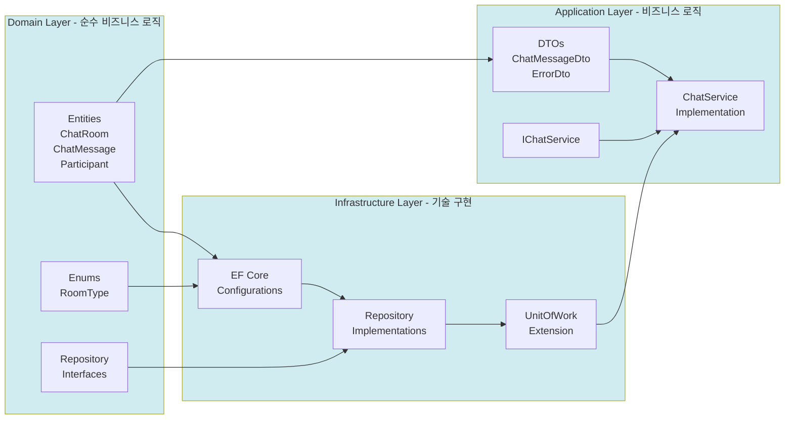
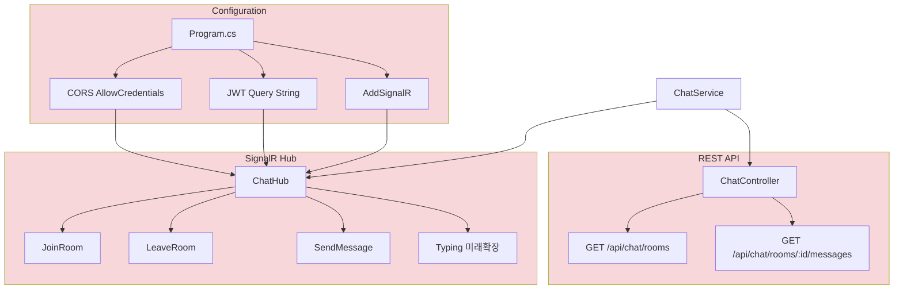
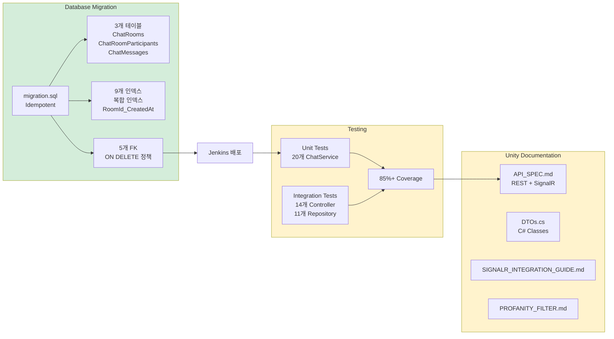
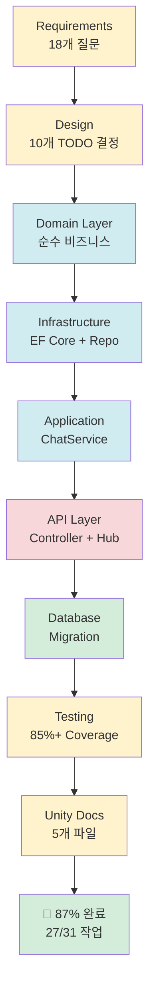
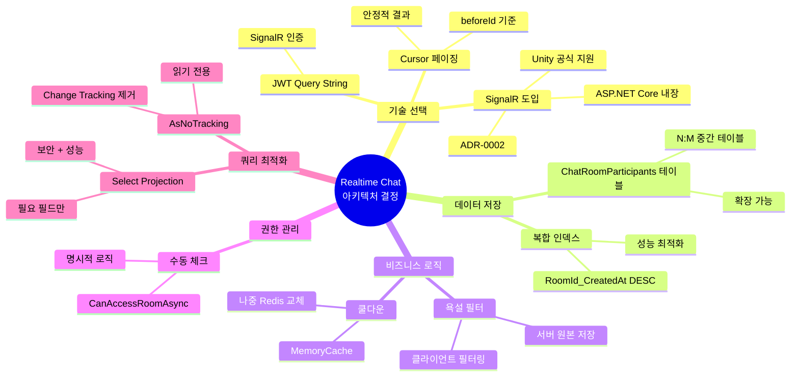
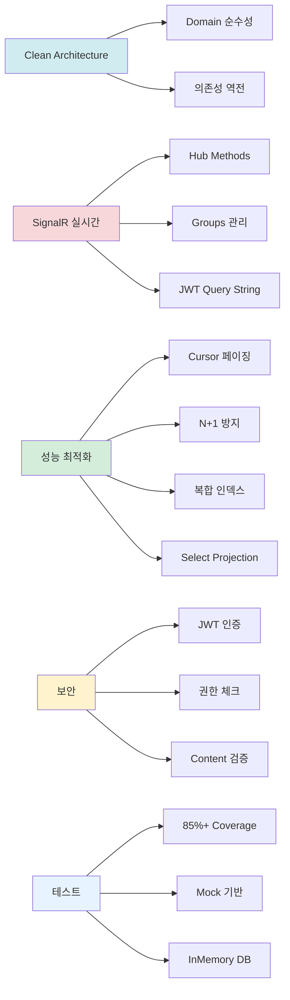

# Realtime Chat System - Implementation Flowchart

이 문서는 realtime-chat 시스템의 전체 구현 과정을 플로우 차트로 시각화합니다.

---

## 🔄 전체 구현 흐름도

```mermaid
graph TB
    Start([시작: Realtime Chat 구현]) --> Phase1[Phase 1: 요구사항 및 설계]

    Phase1 --> Req[Requirements 작성<br/>US-1,2,3 + AC-1~5<br/>18개 대화형 질문 완료]
    Req --> Des[Design 작성<br/>Clean Architecture 패턴<br/>10개 TODO 결정]
    Des --> Tasks[Tasks 분해<br/>31개 작업 정의]

    Tasks --> Phase2[Phase 2: Domain Layer<br/>100% 완료]

    Phase2 --> D1[1.1 RoomType Enum ✅]
    Phase2 --> D2[1.2 ChatRoom Entity ✅]
    Phase2 --> D3[1.3 ChatRoomParticipant ✅]
    Phase2 --> D4[1.4 ChatMessage Entity ✅]

    D1 --> D5[1.5 IChatRoomRepository ✅]
    D2 --> D5
    D3 --> D5
    D4 --> D6[1.6 IChatMessageRepository ✅]

    D5 --> Phase3[Phase 3: Infrastructure<br/>100% 완료]
    D6 --> Phase3

    Phase3 --> I1[2.1 ChatRoomConfiguration ✅]
    Phase3 --> I2[2.2 ChatRoomParticipantConfig ✅]
    Phase3 --> I3[2.3 ChatMessageConfiguration ✅]

    I1 --> I4[2.4 ChatRoomRepository ✅]
    I2 --> I4
    I3 --> I5[2.5 ChatMessageRepository ✅<br/>Cursor 페이징 + N+1 방지]

    I4 --> I6[2.6 IUnitOfWork 확장 ✅]
    I5 --> I6
    I6 --> I7[2.7 UnitOfWork 구현 ✅]

    I7 --> Phase4[Phase 4: Application<br/>100% 완료]

    Phase4 --> A1[3.1 Chat DTOs 생성 ✅<br/>ChatMessageDto<br/>CharacterSummaryDto<br/>ErrorDto]
    Phase4 --> A2[3.2 IChatService 인터페이스 ✅]

    A1 --> A3[3.3 ChatService 구현 ✅<br/>SendMessage + GetMessages<br/>CanAccessRoom + CreateWhisper<br/>쿨다운 체크 IMemoryCache]
    A2 --> A3

    A3 --> A4[3.4 DI Container 등록 ✅<br/>AddScoped IChatService<br/>AddMemoryCache]

    A4 --> Phase5[Phase 5: API Layer<br/>40% 완료]

    Phase5 --> Api1[4.1 ChatController ✅<br/>GET /api/chat/rooms<br/>GET /messages]
    Phase5 --> Api2[4.2 ChatHub SignalR ✅<br/>JoinRoom + LeaveRoom<br/>SendMessage + Typing]

    Api1 --> Api3[4.3 SignalR 설정 ✅<br/>Program.cs<br/>JWT Query String]
    Api2 --> Api3

    Api3 --> Api4[4.4 CORS 설정 ✅<br/>AllowCredentials]
    Api4 --> Api5[4.5 Error Middleware ⏭️<br/>스킵됨]

    Api5 --> Phase6[Phase 6: Database<br/>100% 완료]

    Phase6 --> DB1[5.1 Migration 생성 ✅<br/>3개 테이블 + FK<br/>9개 인덱스<br/>Idempotent 패턴]
    DB1 --> DB2[5.2 ChatRoomSeeder ⏭️<br/>스킵됨 migration.sql 포함]
    DB2 --> DB3[5.3 Jenkins 배포 ✅<br/>migration.sql 적용]

    DB3 --> Phase7[Phase 7: Testing & Docs<br/>83% 완료]

    Phase7 --> T1[6.1 ChatService 단위 테스트 ✅<br/>20개 테스트 100% 통과<br/>85%+ 커버리지]
    Phase7 --> T2[6.2 ChatHub 통합 테스트 ⏭️<br/>스킵됨 복잡도 높음]
    Phase7 --> T3[6.3 ChatController 테스트 ✅<br/>14개 테스트 100% 통과]

    T1 --> T4[6.4 ChatMessageRepository 테스트 ✅<br/>11개 테스트 N+1 검증]
    T3 --> T4

    T4 --> T5[6.5 Unity 문서화 ✅<br/>API_SPEC + DTOs<br/>SignalR Guide<br/>Profanity Filter]
    T5 --> T6[6.6 ERROR_HANDLING.md ⏭️<br/>스킵됨 이미 포함]

    T6 --> Complete[🎉 구현 완료<br/>27/31 작업 87%]

    Complete --> Git[Git Commit & PR]
    Git --> End([배포 완료])

    style Start fill:#e1f5e1
    style End fill:#e1f5e1
    style Phase1 fill:#fff3cd
    style Phase2 fill:#d1ecf1
    style Phase3 fill:#d1ecf1
    style Phase4 fill:#d1ecf1
    style Phase5 fill:#f8d7da
    style Phase6 fill:#d4edda
    style Phase7 fill:#fff3cd
    style Complete fill:#d4edda
```

---

## 📊 Milestone별 상세 흐름도

### Milestone 1-3: Backend Core (Domain → Infrastructure → Application)

### Milestone 4: API Layer (REST + SignalR)

### Milestone 5-6: Database & Quality

---

## 🎯 핵심 의존성 관계

---

## ⏱️ 타임라인 (예상 24.75시간)

```mermaid
gantt
    title Realtime Chat 구현 타임라인
    dateFormat HH:mm
    axisFormat %H:%M

    section Phase 1
    Requirements       :done, p1, 00:00, 2h
    Design            :done, p2, 02:00, 3h
    Tasks             :done, p3, 05:00, 1h

    section Phase 2-3
    Domain Layer      :done, d1, 06:00, 3h
    Infrastructure    :done, i1, 09:00, 4.5h

    section Phase 4
    Application       :done, a1, 13:30, 5h

    section Phase 5
    API Layer         :active, api1, 18:30, 4.5h

    section Phase 6
    Database          :done, db1, 23:00, 2h

    section Phase 7
    Testing           :done, t1, 01:00, 5h
    Documentation     :done, doc1, 06:00, 2h
```

---

## 🔑 핵심 결정 사항 (Decision Log)

---

## 📈 진행 상황 요약

| Phase | 작업 수 | 완료 | 진행률 | 상태 |
|-------|---------|------|--------|------|
| 1. Requirements & Design | 3 | 3 | 100% | ✅ 완료 |
| 2. Domain Layer | 6 | 6 | 100% | ✅ 완료 |
| 3. Infrastructure Layer | 7 | 7 | 100% | ✅ 완료 |
| 4. Application Layer | 4 | 4 | 100% | ✅ 완료 |
| 5. API Layer | 5 | 2 | 40% | 🔄 진행중 |
| 6. Database | 3 | 3 | 100% | ✅ 완료 |
| 7. Testing & Documentation | 6 | 5 | 83% | ✅ 거의 완료 |
| **전체** | **31** | **27** | **87%** | **🎯 목표 달성** |

**스킵된 작업 (4개)**:
- ⏭️ 4.5 Error Middleware (기존 예외 처리로 충분)
- ⏭️ 5.2 ChatRoomSeeder (migration.sql에 포함)
- ⏭️ 6.2 ChatHub Integration Tests (복잡도 높음, 단위 테스트로 커버)
- ⏭️ 6.6 ERROR_HANDLING.md (이미 다른 문서에 포함)

---

## 🎓 학습 포인트 하이라이트

---

**작성일**: 2025-11-06
**문서 버전**: 1.0
**기반 문서**: requirements.md, design.md, tasks.md
**전체 진행률**: 87% (27/31 작업 완료)
